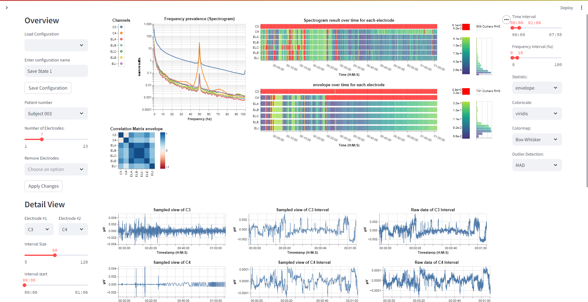

<h1 align="center" id="top">Data Visualization Tool for Locating EEG Artifacts</h1>
<h2 id="wave-about-this-repository">:wave: About This Repository</h2>
This contains the master thesis project created by Anders Schultz, masters student in Data Science at Aarhus University 2024 spring semester.
  
This thesis explores the enhancement of Electroencephalography (EEG) data analysis through the integration of data preprocessing methods and interactive data visualization.
  
At the core of this research is the development of an interactive visualization tool, designed to support EEG experts in their data preparation workflows. The tool provides an overview of EEG data with multiple coordinated views, including a spectrogram chart, a frequency chart, and a correlation matrix, enabling real-time data exploration for artifact detection. It support interaction techniques such as brushing and cross-filtering, and the user interface offers extensive customization options.

<h2 id="book-table-of-contents">:book: Table of Contents</h2>

  
Table of Contents

  <ol>
    <li><a href="#wave-about-this-repository">About This Repository</a></li>
    <li><a href="#book-table-of-contents">Table of Contents</a></li>
    <li><a href="#raw-data-structure">Raw Data Structure</a></li>
    <li>
      <a href="#data-preprocessing">Data preprocessing</a>
      <ul>
        <li><a href="#main">Main</a></li>
        <li><a href="#raw-data">Raw Data</a></li>
        <li><a href="#metric-calculations">Metric Calculations</a></li>
        <li><a href="#spectrogram analysis">Spectrogram Analysis</a></li>
      </ul>
    </li>
    <li>
      <a href="#eeg-visualization-tool">EEG Visualization Tool</a>
      <ul>
        <li><a href="#books-thesis-report">Thesis Report</a></li>
        <li><a href="#movie_camera-video-showcase">Video Showcase</a></li>
        <li><a href="#spy-artifact-detection">Artifact Detection</a></li>
      </ul>
    </li>
  </ol>

<h2 id="raw-data-structure">Raw Data Structure</h2>
This thesis worked with Electroencephalography (EEG) data that follows the Brain Imaging Data Structure (BIDS), which standardizes folder structure, naming conventions, metadata files, JSON files and much more.
  
The data utilized for testing purposes in this project originate from Openneuro: <a href="https://openneuro.org/datasets/ds004348/versions/1.0.4">Link</a>. For more information about the data and how it was collected, feel free to check it out.
  
<h2 id="data-preprocessing">Data Preprocessing</h2>
<h3 id="main">📁 Main File</h3>
This is the original file from where the data preprocessing begins. It imports the methods from the other 3 files, and executes the process on select EEG data. It is possible to customize some of the values used for metric calculations like envelope, sequences passing thresholds etc.
  
The path of the EEG data .set / .fdt file needs to be inserted into the code, and that's the main requirement for full functionality. 
<h3 id="raw-data">👩🏻‍💻 Raw Data Filtering</h3>
This preprocessing step requires the MNE python library. It performs standardized procedures like band-pass-filter, sampling the data and cleaning missing values.
  
The functions currently assume that the data already has average of all electrodes subtracted from all electrodes. If not, adjust the first function to include it using MNE.
<h3 id="metric-calculations">📊 Metric Calculations</h3>
This file provides methods for calculating new metrics for the EEG data, and performs aggregation on each of these metrics afterwards. The list of metrics calculated are explained in greater detail in the thesis report.
  
The final product is an aggregated pandas dataframe containing relevant EEG metrics, and this frame gets stored using Parquet files.
<h3 id="spectrogram analysis">🔊 Spectrogram Analysis</h3>
The main method performs spectrogram calculations of a time series. It is basically a slightly polished version of scipy.signal._fft_helper. Arguments are explained inside the function. 
  
The other method calls the spectrogram method for all channels, and then arranges the result into the desired long data structure. In the main file, this dataframe is saved as Parquet files.
<h2 id="eeg-visualization-tool"> EEG Visualization Tool</h2>

Visit the application using this <a href="https://eeg-visualization-tool-py-as.streamlit.app">Link</a> with PW: 123321
<h3 id="books-thesis-report">:books: Thesis Report</h3>
The folder "Thesis" contains the Master Thesis Report written for this project. Check it out if you want a more detailed account of the entire process, including EEG talk, litterature, data preprocessing, design choices, implementation software and discussion of the resulting tool. 
<h3 id="movie_camera-video-showcase">:movie_camera: Video Showcase</h3>
<a href = https://www.youtube.com/watch?v=q0UK1dZ_DFI>Youtube Video showcasing the tool</a>
<h3 id="spy-artifact-detection">🕵️ Artifact Detection</h3>

<h3 align="center">
  (More information coming soon)
</h3>

